## [CLaunch](https://www.appinn.com/claunch/) 桌面启动器

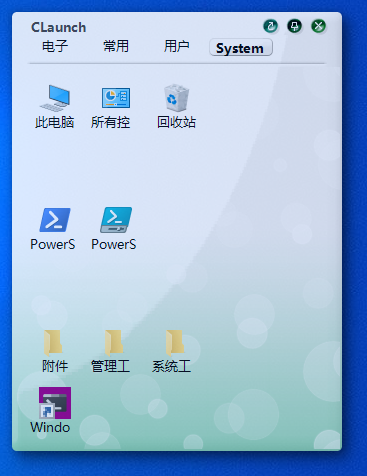

## 磁盘空间可视化 [Scanner](http://steffengerlach.de/freeware/)

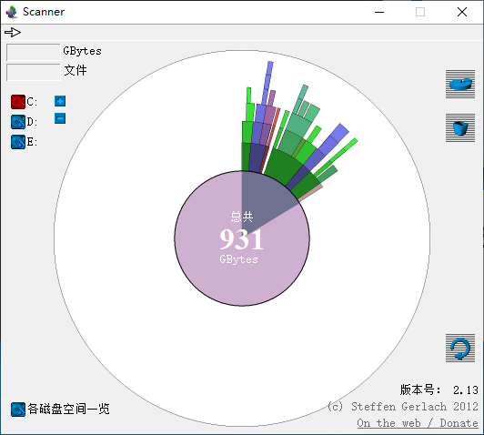

## [CopyQ](https://hluk.github.io/CopyQ/)

记录剪贴板历史工具

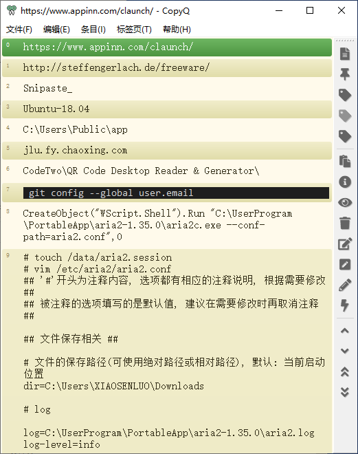

## [QTranslate](https://quest-app.appspot.com/home)

翻译小工具, 非常好用, 选中要翻译的文字, 双击"Ctrl"键就可以看结果. 注意"设置->高级->域"应该选择"cn".

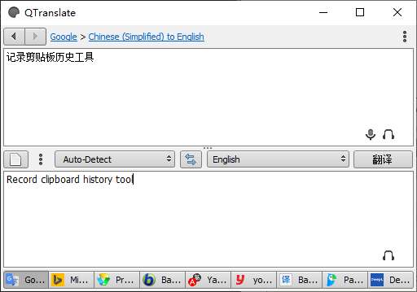

## 截图 [Snipaste](https://zh.snipaste.com/)

非常好用的截图工具

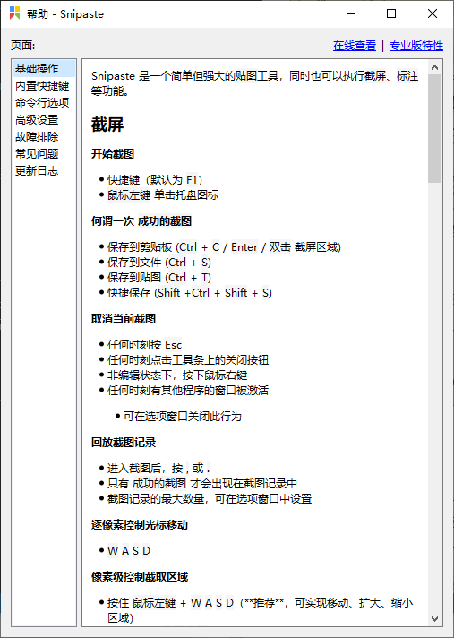

## 任务栏显示网速工具 [TrafficMonitor](https://github.com/zhongyang219/TrafficMonitor)

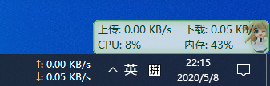

## 下载神器
  - **IDM(Internet Download Manager)**
    付费工具, 但是十分强大, 利用多线程, 能跑满带宽, 能自动捕获浏览器下载请求, 嗅探视频, 音乐..........

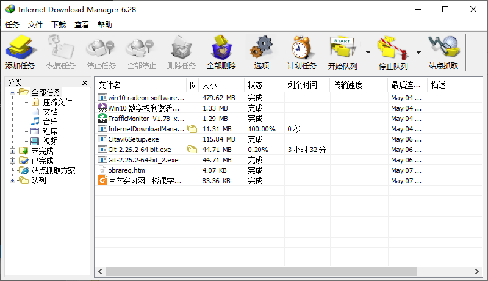

  - **[NDM(Neat Download Manager)](https://ninjadownloadmanager.com/)**
    免费工具, 仿IDM的, 核心功能一样, 但是设置没有IDM多.

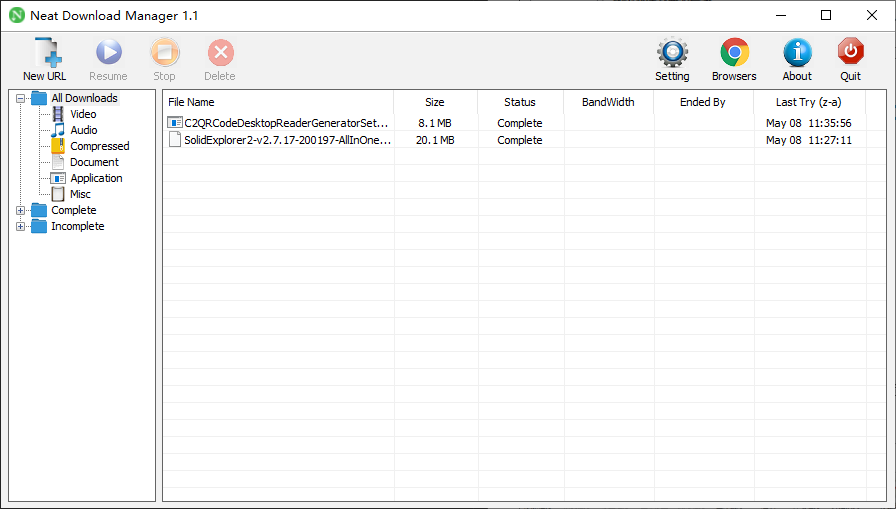

## 个人非常喜欢的一套[鼠标图标](assets/cursors.zip)

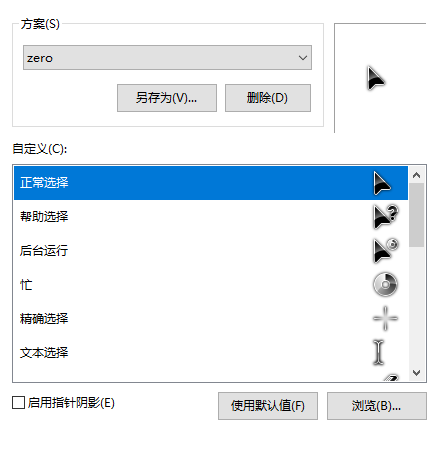

## DNS修改 [DNSJumper](https://www.sordum.org/7952/dns-jumper-v2-2/)

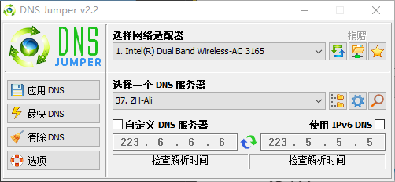

## 二维码扫描 [QR Code Desktop Reader](https://www.codetwo.com/freeware/qr-code-desktop-reader/?sts=1375)

能用级别

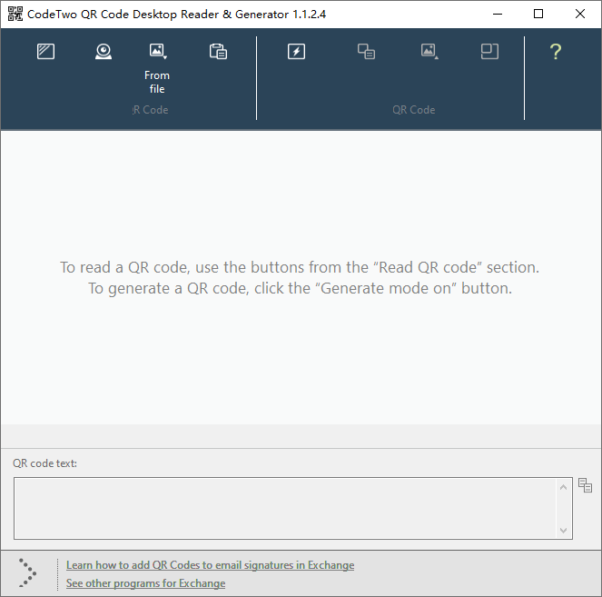

## 磁盘清理 [Wise Disk Cleaner](https://www.wisecleaner.com/wise-disk-cleaner.html)

算是 CCleaer变味之后的替代者

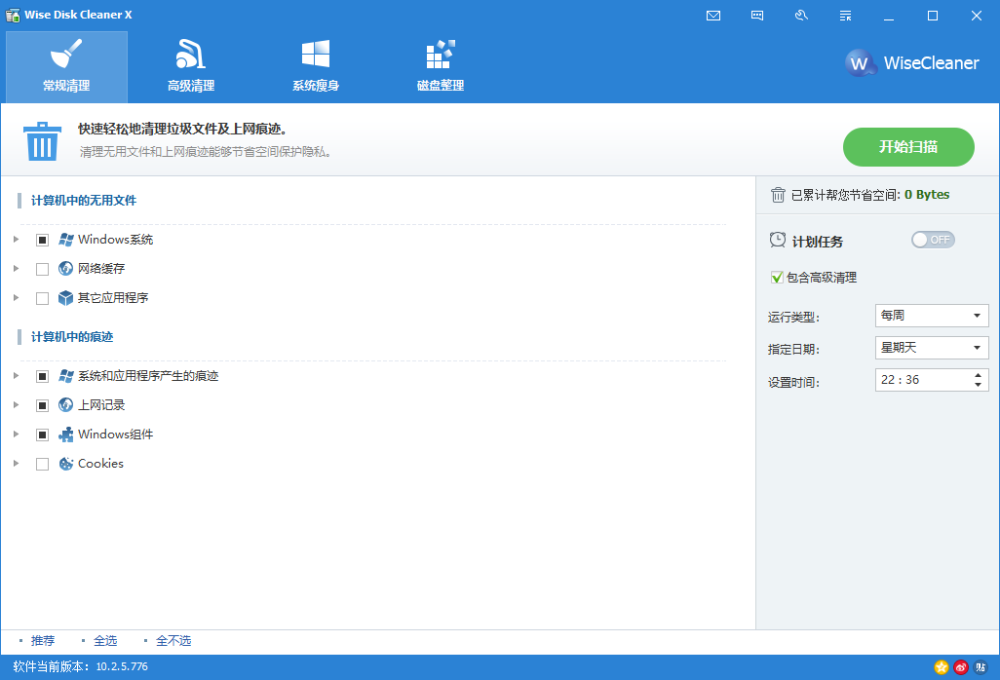

## 卸载神器 [Total Uninstall 6]()

付费工具, 但是非常强大, 能卸载干净很多软件残留垃圾, 还能监控安装

左键要安装的程序, 选择"用 Total Uninstall 监视".

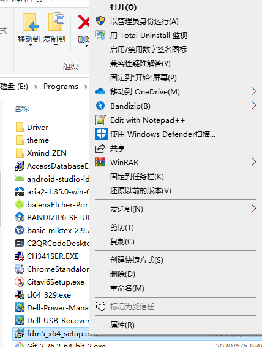